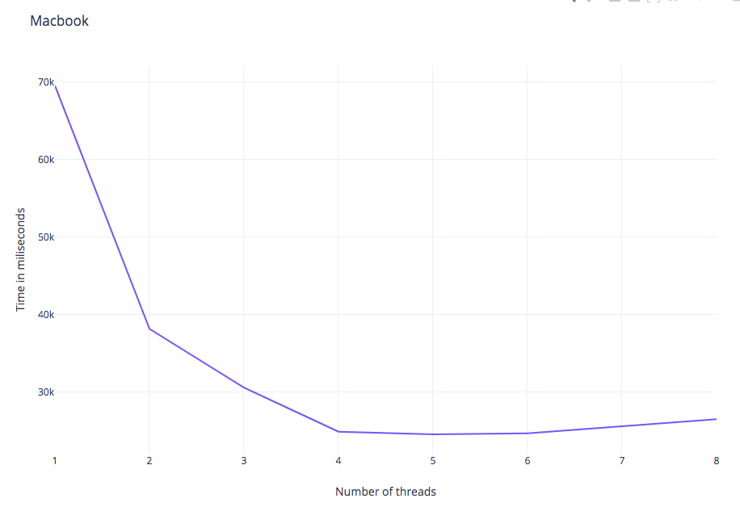

# IntegralMultithreading

## Розпаралелення обрахунку інтегралу заданої функції (ВАРІАНТ 1)

## Introduction
This program finds the intral of the function of two variables using multithreading.


## Installation and compilation
  ```bash
  $ git clone https://github.com/Rosovskyy/IntegralMultithreading
  $ cd CPP_Lab_2
  $ mkdir build
  $ cd build
  $ cmake -G"Unix Makefiles" ..
  $ make
  ```
## Running 
  <i>(Inside the <b>bin</b> directory)</i>
  ### CPP FILE
  <b>One thread file:</b><br>
    ```bash
    $ ./integrate_one_thread <input_file>
    ```<br>
  <b>Multi thread file:</b><br>
    ```bash
    $ ./integrate_multi_thread <number_of_threads> <input file>
    ```<br>
  ### Python script
    $ python3 script.py <program_name> <number_of_threads_for_multiple_threads_program> <times_to_run_the_program> <multiple_threads/both> <wanted_error> <conf_file> <exe>
    
  <b>All threads from 1..N</b><br>
    ```
    $ python3 script_different_threads.py <number_of_threads> <times_to_run_the_program>
    ```


## The table of the working time of each method.
We tested the program on two different notebooks and data
The first data file is <b>conf.txt</b>, the second one - <b>conf2.txt</b>
### <a href="https://docs.google.com/spreadsheets/d/1Lz7ZOkt46eSk6qM3eEByrSSz2cZqpVWvGWbCdWl-CMg/edit#gid=0">Acer(Evhenii Molodtsov)</a>


### <a href="https://docs.google.com/spreadsheets/d/1Lz7ZOkt46eSk6qM3eEByrSSz2cZqpVWvGWbCdWl-CMg/edit#gid=0">Macbook(Serhii Rosovskyi)</a>




## License and copyright
© Evhenii Molodtsov and Serhiy Rosovskyy, students of the Ukrainian Catholic University
